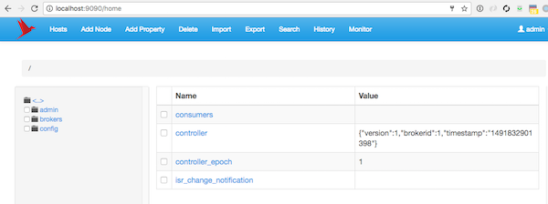

# plain-kafka
Plain kafka image

```
$ docker stack deploy --compose-file docker-compose.yml kafka
Creating network kafka_default
Creating service kafka_zkui
Creating service kafka_broker
Creating service kafka_zookeeper
$
```


